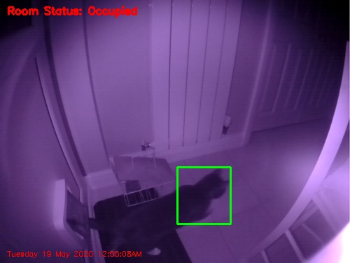
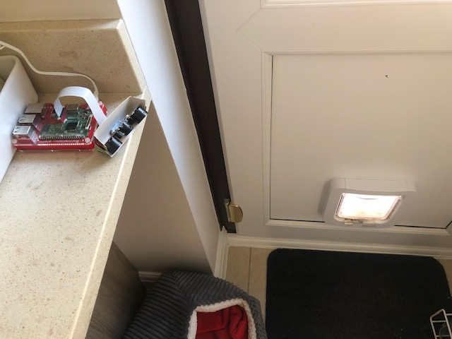

# Cat Tracker 2000



This is a small python application that tracks cats (and other movement) on a Raspberry Pi.

It uses OpenCV to perform the motion detection.

The project was based on [a couple of blog posts by Adrian Rosebrock](https://www.pyimagesearch.com/2015/06/01/home-surveillance-and-motion-detection-with-the-raspberry-pi-python-and-opencv/)

## Contents
- [Cat Tracker 2000](#cat-tracker-2000)
  - [Contents](#contents)
- [Prerequisites](#prerequisites)
- [Usage](#usage)

# Prerequisites

* A Raspberry Pi (3 Model B+ or above is recommended, perhaps a [Raspberry Pi 4 B](https://shop.pimoroni.com/products/raspberry-pi-4?variant=29157087412307))
* A nice big Micro SD Card [from Amazon?](https://www.amazon.co.uk/SanDisk-Extreme-microSDXC-Adapter-Performance/dp/B07FCMBLV6/ref=asc_df_B07FCMBLV6/)
* A camera (i.e. an infra-red wide-angle lense camera with built-in infra-red LEDs from [Pimoroni](https://shop.pimoroni.com/products/night-vision-camera-module-for-raspberry-pi?variant=12516582752339))
* Raspbian "Buster" (available from the [raspberrypi.org website](https://www.raspberrypi.org/downloads/))
* Python 3 (included with "Buster")
* OpenCV (see below...)




I got the following instructions from [this blog post](https://www.pyimagesearch.com/2019/09/16/install-opencv-4-on-raspberry-pi-4-and-raspbian-buster/) to set up OpenCV:

1. Get a Raspberry Pi 3 B+ or 4 B.
2. Ensure it is running Raspbian "Buster".  (see the above link in the prerequisites, the above blog post or Google for how to do this).
3. Ensure you have "Expanded the filesystem".  Do this by running the `raspi-config` tool using `sudo` and choosing Advanced Options -> Expand Filesystem.
4. Also ensure that the camera is enabled using `raspi-config` by going into the Interfacing Options section.
5. Reboot your Pi (`sudo reboot`)
6. Install a boat-load of dependencies (again see the post for what they all are):

```bash
sudo apt-get update && sudo apt-get upgrade
sudo apt-get install build-essential cmake pkg-config
sudo apt-get install libjpeg-dev libtiff5-dev libjasper-dev libpng-dev
sudo apt-get install libavcodec-dev libavformat-dev libswscale-dev libv4l-dev
sudo apt-get install libxvidcore-dev libx264-dev
sudo apt-get install libfontconfig1-dev libcairo2-dev
sudo apt-get install libgdk-pixbuf2.0-dev libpango1.0-dev
sudo apt-get install libgtk2.0-dev libgtk-3-dev
sudo apt-get install libatlas-base-dev gfortran
sudo apt-get install libhdf5-dev libhdf5-serial-dev libhdf5-103
sudo apt-get install libqtgui4 libqtwebkit4 libqt4-test python3-pyqt5
sudo apt-get install python3-dev
```

7. Install pip and virtualenv:

```bash
wget https://bootstrap.pypa.io/get-pip.py
sudo python get-pip.py
sudo python3 get-pip.py
sudo rm -rf ~/.cache/pip
sudo pip install virtualenv virtualenvwrapper
```

8. Set up your virtualenv.  Run `nano ~/.bashrc` and then add the following to the BOTTOM of the file:

```bash
# virtualenv and virtualenvwrapper
export WORKON_HOME=$HOME/.virtualenvs
export VIRTUALENVWRAPPER_PYTHON=/usr/bin/python3
source /usr/local/bin/virtualenvwrapper.sh
```
Save and exit.  Then reload the .bashrc to ensure it is being used:

```bash
source ~/.bashrc
```

Then make your "cv" virtualenv:

```bash
mkvirtualenv cv -p python3
```

9. Install picamera:

```bash
pip install "picamera[array]"
```

10. Install opencv:

```bash
pip install opencv-contrib-python==4.1.0.25
```

11. Test the install:

```bash
cd ~
workon cv
python
>>> import cv2
>>> cv2.__version__
'4.1.0'
>>>
```

If this works then all is good!

# Usage

Then run the application at the command line using:

```bash
python3 pi_surveillance.py --conf config.json
```

By default it will detect motion and save images into a `./images` subdirectory.